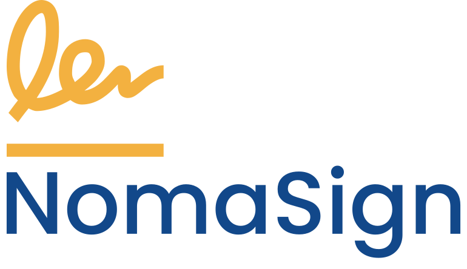

  

  <a href="https://www.nomasign.com">Website</a> •
  <a href="https://app.nomasign.com">Web App</a> •
  <a href="https://chromewebstore.google.com/detail/nomasign-browser-plugin/ajoabdohkndnbggkhdfappoffhhipdmf">Chrome Extension</a> •
  <a href="https://microsoftedge.microsoft.com/addons/detail/nomasign-browser-plugin/lhnfjnfcfieihemgadmaamdgpjmgnjoo">Edge Extension</a> •
  <a href="https://linkedin.com/company/nomasign">LinkedIn</a>

 
 
 

## Repos

- [IntegrationExamples](https://github.com/Nomasign/IntegrationExamples) — Full-stack integration examples (.NET + React) for the NomaSign API
 
 
 

## NomaSign

**Simple Digital Signing for Every Business**

NomaSign makes digital signing simple, secure and affordable for businesses of all sizes. Sign documents online in minutes — not days — with full audit trails and cloud storage integration.

## What makes us different

- **Unlimited documents** — flat monthly fee, no per-document charges or envelope limits
- **Your data, your cloud** — documents stay in your own OneDrive or Google Drive, not ours
- **Emails from your domain** — signing requests come from you, not a third party
- **No app required** — signers review and sign entirely in-browser
- **Browser extension** — detect PDFs and send for signing in one click

## How it works

1. Upload a PDF (from your computer, OneDrive or Google Drive)
2. Add signers and drag-drop signature fields
3. Send — signers get a secure link via email
4. Recipients sign in-browser in under 2 minutes
5. Completed document auto-saves to your cloud storage with a full audit trail
